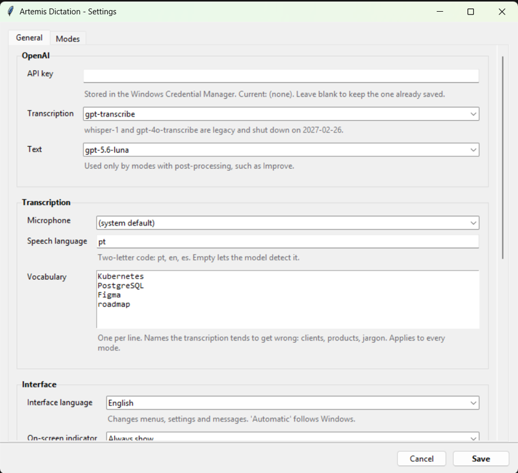
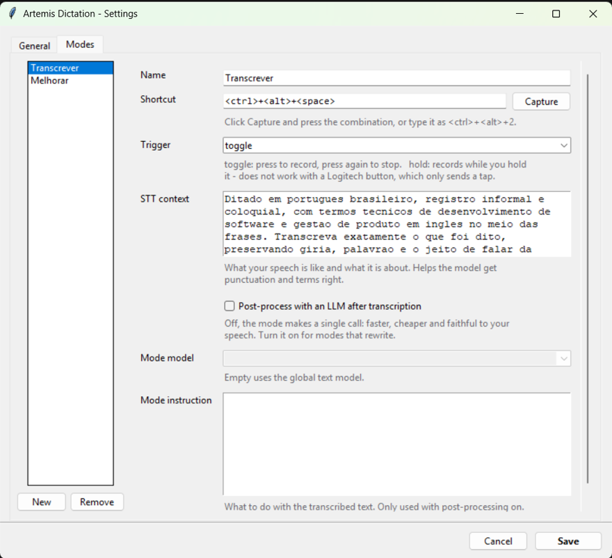

# Artemis Dictation

**Global voice dictation for Windows.** Press a shortcut, talk, and the text lands in whatever field your cursor is in — browser, WhatsApp Web, Teams, Slack, Discord, Obsidian, VS Code, Word, Azure DevOps.

[](https://www.python.org/)
[](https://www.microsoft.com/windows)
[](LICENSE)

🇧🇷 **[Leia em português](README.pt-BR.md)**  ·  Interface available in **English, Portuguese and Spanish**.

```
shortcut  →  record  →  speech-to-text  →  [mode]  →  clipboard  →  Ctrl+V
```

It replaces the built-in Windows dictation with something you actually control: your own prompts, your own vocabulary, and **modes** — the same speech can come out verbatim, cleaned up, or rewritten, depending on which shortcut you press.

## What makes it different

**Modes are configuration, not code.** A mode is a JSON entry with a name, a hotkey, a prompt and a model. Two ship by default — *Transcribe* (faithful) and *Improve* (cleaned up) — and adding *Formal*, *Casual*, *Summarize* or *Translate* means editing a file, never touching the pipeline.

**Your dictation is never lost.** Injecting `Ctrl+V` only guarantees the keystroke was sent — not that a text field received it. So the text stays on the clipboard, the last 10 dictations live in the tray menu, and the on-screen indicator shows a preview of what came out.

**Audio never touches disk.** It is captured to memory as 16 kHz mono PCM and uploaded straight from there. No temp file to leak, none to clean up.

**Your API key is not in a config file.** It goes to the Windows Credential Manager, encrypted with DPAPI and tied to your Windows account.

**It speaks your language.** The interface comes in English, Portuguese and Spanish, and follows your Windows display language by default. The starter modes ship with prompts written in whichever language you land on.

## Requirements

- Windows 10 or 11
- Python 3.11+
- An [OpenAI API key](https://platform.openai.com/api-keys)

## Quick start

```bash
git clone https://github.com/matheuscastelliano/Artemis-Dictation.git
cd Artemis-Dictation
py -m venv .venv
.venv\Scripts\python.exe -m pip install -r requirements.txt
.venv\Scripts\python.exe -m artemis --set-key    # you type the key; it never echoes
```

Then double-click `Artemis.cmd`. A grey dot appears in the system tray.

| Shortcut | Mode | What it does |
|---|---|---|
| `Ctrl + Alt + Space` | **Transcribe** | Faithful to your speech. Punctuation, capitalization, proper nouns. No rewriting. |
| `Ctrl + Alt + 1` | **Improve** | Transcribes, then cleans up: drops filler and repetition, improves structure, keeps your tone. |

Press once to start recording (high beep), talk, press again to stop (low beep). The text is pasted for you.

| Tray colour | State |
|---|---|
| Grey | Idle |
| Red | Recording |
| Orange | Processing |
| Green | Pasted |

## Screenshots

| Settings — General | Settings — Modes |
|---|---|
|  |  |

## Adding a mode

Modes live in `%APPDATA%\ArtemisDictation\presets.json`, and there is an editor in the settings window. A mode looks like this:

```json
{
  "id": "formal",
  "name": "Formal",
  "description": "Turns speech into a message for a client or manager",
  "hotkey": "<ctrl>+<alt>+2",
  "trigger": "toggle",
  "stt_prompt": "Dictation, informal register, product and engineering jargon...",
  "keywords": ["Kubernetes", "PostgreSQL"],
  "refine": true,
  "system_prompt": "Rewrite the transcript as professional communication...",
  "text_model": null
}
```

| Field | What it does |
|---|---|
| `hotkey` | pynput format: `<ctrl>+<alt>+2`, `<ctrl>+<shift>+d`, `<f9>`. The *Capture* button writes it for you. |
| `trigger` | `toggle` (press/press) or `hold` (record while held). |
| `stt_prompt` | Free-form context for the transcription model: how you speak, what about. |
| `keywords` | Terms the model tends to get wrong, added to the global list. |
| `refine` | `false` = a single API call. `true` = post-process the transcript with an LLM. |
| `system_prompt` | The mode's instruction. Only used when `refine` is `true`. |
| `text_model` | `null` falls back to the global text model. |

## Programmable keyboard buttons (Logitech and friends)

There is no public SDK for reading Logi Options+ buttons, so the route is to make the button emit the shortcut:

1. Open **Logi Options+** and pick your keyboard.
2. Choose the key you want (the Windows dictation key is a good candidate).
3. Assign **Keystroke**.
4. Press `Ctrl + Alt + Space` in the capture field and save.

Artemis' keyboard hook sees injected input, so it behaves exactly like a real keypress.

> **Options+ limitation:** it sends the combination as an instant press-and-release — it cannot *hold* a key. Modes triggered by a hardware button therefore need `trigger: "toggle"`. Use a regular keyboard shortcut if you want push-to-talk.

## How it works

**Transcription model: `gpt-transcribe`.** OpenAI's current speech-to-text model (July 2026). It cuts `whisper-1`'s word error rate from 40.4% to 19.3% and costs less ($0.0045/min vs $0.006/min) — there is no trade-off. `whisper-1`, `gpt-4o-transcribe` and `gpt-4o-mini-transcribe` are **deprecated and shut down on 2027-02-26**. `gpt-transcribe` also accepts `keywords` and `languages`, which is what fixes proper nouns and foreign technical terms dropped into everyday speech.

**Faithful mode makes one API call.** `gpt-transcribe` already punctuates well, so sending the transcript through an LLM would only add latency and the exact risk the mode exists to avoid. Modes that rewrite use `gpt-5.6-luna`, the cheap text model — around US$0.001 per 15-second dictation.

**Clipboard + `Ctrl+V`, not UI Automation.** UI Automation does not work in Electron/Chromium apps — which is precisely WhatsApp Web, Teams, Slack, Discord and VS Code. The clipboard works in essentially every Windows text field.

**The keyboard hook does no work.** `pynput` callbacks run *inside* the `WH_KEYBOARD_LL` hook, and Windows silently unregisters hooks that exceed `LowLevelHooksTimeout` (300 ms by default). Opening PortAudio takes ~200 ms, so the hook only enqueues; a separate thread does the work.

**It waits for your modifiers.** Injecting `Ctrl+V` while you are still holding `Ctrl+Alt` produces `Ctrl+Alt+V`, which pastes nothing. Artemis waits for the keys to come up first.

**~0% CPU at rest.** The microphone is only opened while recording. What stays resident is a keyboard hook, a tray icon and an idle Tk loop.

## Project layout

```
artemis/
├─ __main__.py          entry point, wiring, CLI
├─ app.py               state machine: idle → recording → processing
├─ config.py            config.json / presets.json + defaults
├─ i18n.py              interface translations (en / pt / es)
├─ startup.py           the "start with Windows" registry entry
├─ presets.py           the Preset dataclass
├─ secrets_store.py     Windows Credential Manager
├─ audio.py             microphone capture (sounddevice)
├─ hotkeys.py           global hotkeys, toggle and hold
├─ pipeline.py          audio → transcript → final text
├─ output.py            clipboard, focus, paste, fallbacks
├─ errors.py
├─ providers/
│  └─ openai_provider.py   the only module that knows about OpenAI
└─ ui/
   ├─ tray.py
   ├─ overlay.py
   └─ settings_window.py
```

Dependencies: `openai`, `sounddevice`, `pynput`, `pystray`, `Pillow`, `pyperclip`, `keyring`. Everything else is standard library — Tkinter, `wave`, `ctypes`.

## Configuration

Tray icon → **Settings**, or edit the JSON directly. Everything lives in `%APPDATA%\ArtemisDictation\`: `config.json`, `presets.json` and a rotating `artemis.log`.

Worth knowing about:

| Setting | What it does |
|---|---|
| **Interface language** | English, Portuguese, Spanish, or Automatic (follows your Windows display language). |
| **On-screen indicator** | *Always* · *Only on errors* · *Never*. The tray icon still changes colour in all three cases, so you never lose feedback entirely. |
| **Show the dictated text** | A 120-character preview in the indicator, adjustable from 40 to 400. |
| **Start with Windows** | Registers Artemis under the current user's `Run` key — no administrator rights, no scheduled task. |
| **Restore previous clipboard** | Off by default; see above for why. |

Extra knobs that only exist in the file:

| Option | Default | What it does |
|---|---|---|
| `history_size` | `10` | Dictations kept in the tray menu. `0` disables the history. |
| `max_recording_seconds` | `600` | Stops a forgotten recording on its own. |
| `min_recording_seconds` | `0.4` | Below this, treats it as an accidental keypress and skips the API call. |

## Adding a language

Translations are a single flat dictionary per language in [`artemis/i18n.py`](artemis/i18n.py). Copy the `en` block, translate the values, and register the code in `LANGUAGE_NAMES`. A missing key falls back to English rather than crashing, so a partial translation is safe to ship.

## Build an .exe

```bash
.venv\Scripts\python.exe -m pip install pyinstaller
.venv\Scripts\pyinstaller.exe --noconsole --onefile --name Artemis run.pyw
```

Configuration stays in `%APPDATA%`, so it survives rebuilds.

## Troubleshooting

| Symptom | Likely cause |
|---|---|
| Shortcut does nothing in one specific app | That app runs elevated and Artemis does not. Run Artemis elevated too — a keyboard hook receives no events from more privileged windows. |
| Shortcut does nothing anywhere | Another program claimed the same combination. Change it in the settings. |
| Records but does not paste | Usually no text field had focus. The text is on the clipboard and in *Últimos ditados* in the tray menu. |
| Clipboard is wiped after pasting | The "restore previous clipboard" option is on. Turn it off. |
| Always mistranscribes the same name | Add the term to the vocabulary list in the settings. |
| Two dictations per press | Two instances were running. The second one now refuses to start. |

Run with a console log:

```bash
.venv\Scripts\python.exe -m artemis --debug
```

## License

MIT — see [LICENSE](LICENSE).
