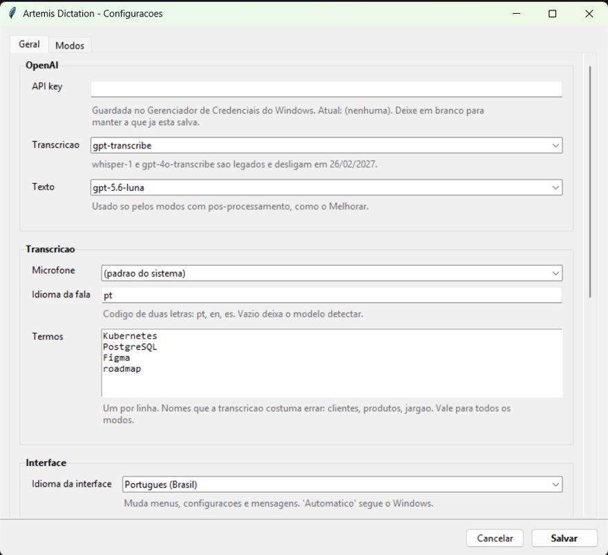
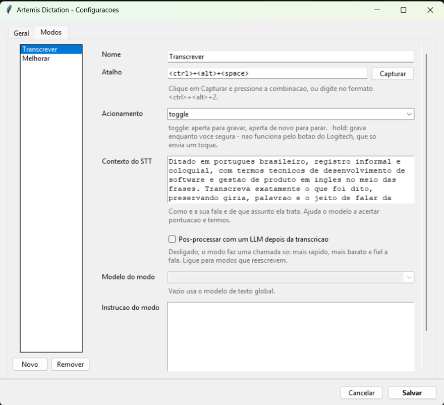

# Artemis Dictation

**Ditado por voz global para Windows.** Aperta um atalho, fala, e o texto aparece no campo onde o cursor está — navegador, WhatsApp Web, Teams, Slack, Discord, Obsidian, VS Code, Word, Azure DevOps.

[](https://www.python.org/)
[](https://www.microsoft.com/windows)
[](LICENSE)

🇺🇸 **[Read in English](README.md)**  ·  Interface disponível em **português, inglês e espanhol**.

```
atalho  →  grava  →  speech-to-text  →  [modo]  →  clipboard  →  Ctrl+V
```

Substitui a digitação por voz nativa do Windows por algo que você controla: seus prompts, seu vocabulário e **modos** — a mesma fala pode sair literal, limpa ou reescrita, dependendo do atalho que você apertar.

## O que muda em relação a um ditado comum

**Modos são configuração, não código.** Um modo é uma entrada JSON com nome, atalho, prompt e modelo. Dois já vêm prontos — *Transcrever* (fiel) e *Melhorar* (limpo) — e adicionar *Formal*, *Casual*, *Resumir* ou *Traduzir* é editar um arquivo, nunca mexer no pipeline.

**Nenhum ditado se perde.** Injetar `Ctrl+V` só garante que a tecla foi enviada — não que um campo de texto recebeu. Então o texto fica no clipboard, os últimos 10 ditados ficam no menu da bandeja, e o indicador na tela mostra uma prévia do que saiu.

**O áudio nunca toca o disco.** É capturado em memória como PCM mono de 16 kHz e enviado direto de lá. Não há arquivo temporário para vazar nem para apagar.

**A API key não fica em arquivo de configuração.** Vai para o Gerenciador de Credenciais do Windows, cifrada com DPAPI e amarrada à sua conta.

**Fala o seu idioma.** A interface vem em português, inglês e espanhol, e por padrão segue o idioma do seu Windows. Os modos iniciais já nascem com os prompts escritos no idioma escolhido.

## Requisitos

- Windows 10 ou 11
- Python 3.11+
- Uma [API key da OpenAI](https://platform.openai.com/api-keys)

## Começando

```bash
git clone https://github.com/matheuscastelliano/Artemis-Dictation.git
cd Artemis-Dictation
py -m venv .venv
.venv\Scripts\python.exe -m pip install -r requirements.txt
.venv\Scripts\python.exe -m artemis --set-key    # você digita a chave; ela não ecoa
```

Depois é só dar duplo clique em `Artemis.cmd`. Um ponto cinza aparece na bandeja.

| Atalho | Modo | O que faz |
|---|---|---|
| `Ctrl + Alt + Espaço` | **Transcrever** | Fiel à fala. Pontuação, capitalização e nomes próprios. Não reescreve. |
| `Ctrl + Alt + 1` | **Melhorar** | Transcreve e limpa: tira repetições e vícios de linguagem, melhora a estrutura, mantém o tom. |

Aperta uma vez para gravar (beep agudo), fala, aperta de novo para parar (beep grave). O texto é colado sozinho.

| Cor na bandeja | Estado |
|---|---|
| Cinza | Pronto |
| Vermelho | Gravando |
| Laranja | Processando |
| Verde | Colado |

## Telas

| Configurações — Geral | Configurações — Modos |
|---|---|
|  |  |

## Criando um modo

Os modos ficam em `%APPDATA%\ArtemisDictation\presets.json`, e há um editor na janela de configurações. Um modo é assim:

```json
{
  "id": "formal",
  "name": "Formal",
  "description": "Vira mensagem para cliente ou gestor",
  "hotkey": "<ctrl>+<alt>+2",
  "trigger": "toggle",
  "stt_prompt": "Ditado em português brasileiro, registro informal...",
  "keywords": ["Azure DevOps", "Red Hat"],
  "refine": true,
  "system_prompt": "Transforme a fala em uma comunicação profissional...",
  "text_model": null
}
```

| Campo | Para que serve |
|---|---|
| `hotkey` | Formato do pynput: `<ctrl>+<alt>+2`, `<ctrl>+<shift>+d`, `<f9>`. O botão *Capturar* escreve isso pra você. |
| `trigger` | `toggle` (aperta/aperta) ou `hold` (grava enquanto segura). |
| `stt_prompt` | Contexto livre para o modelo de transcrição: como você fala, sobre o quê. |
| `keywords` | Termos que o modelo costuma errar, somados à lista global. |
| `refine` | `false` = uma chamada de API só. `true` = pós-processa a transcrição com um LLM. |
| `system_prompt` | A instrução do modo. Só usada quando `refine` é `true`. |
| `text_model` | `null` usa o modelo de texto global. |

## Botões programáveis do teclado (Logitech e afins)

Não existe SDK público para ler os botões do Logi Options+, então o caminho é fazer o botão emitir o atalho:

1. Abra o **Logi Options+** e selecione o teclado.
2. Escolha a tecla (a de digitação por voz do Windows é uma boa candidata).
3. Atribua **Keystroke** (Atribuição de tecla).
4. Pressione `Ctrl + Alt + Espaço` no campo de captura e salve.

O hook de teclado do Artemis enxerga input injetado, então funciona igual a teclar de verdade.

> **Limitação do Options+:** ele envia a combinação como um toque instantâneo — não consegue *segurar* a tecla. Modos acionados por botão físico precisam de `trigger: "toggle"`. Use um atalho do teclado normal se quiser push-to-talk.

## Como funciona

**Modelo de transcrição: `gpt-transcribe`.** É o modelo atual de speech-to-text da OpenAI (jul/2026). Corta o word error rate do `whisper-1` de 40,4% para 19,3% e custa menos ($0.0045/min contra $0.006/min) — não há trade-off. `whisper-1`, `gpt-4o-transcribe` e `gpt-4o-mini-transcribe` estão **deprecados e desligam em 26/02/2027**. O `gpt-transcribe` também aceita `keywords` e `languages`, que é o que resolve nomes próprios e termos técnicos em inglês no meio do português.

**O modo fiel faz uma chamada só.** O `gpt-transcribe` já pontua bem, então passar a transcrição por um LLM só adicionaria latência e exatamente o risco que o modo existe para evitar. Modos que reescrevem usam o `gpt-5.6-luna`, o modelo de texto barato — cerca de US$ 0,001 por ditado de 15 segundos.

**Clipboard + `Ctrl+V`, não UI Automation.** UI Automation não funciona em apps Electron/Chromium — justamente WhatsApp Web, Teams, Slack, Discord e VS Code. O clipboard funciona em praticamente todo campo de texto do Windows.

**O hook de teclado não faz trabalho nenhum.** Os callbacks do `pynput` rodam *dentro* do hook `WH_KEYBOARD_LL`, e o Windows remove em silêncio os hooks que estouram o `LowLevelHooksTimeout` (300 ms por padrão). Abrir o PortAudio leva ~200 ms, então o hook só enfileira; uma thread separada faz o trabalho.

**Ele espera você soltar os modificadores.** Injetar `Ctrl+V` enquanto você ainda segura `Ctrl+Alt` produz `Ctrl+Alt+V`, que não cola nada. O Artemis espera as teclas subirem antes.

**~0% de CPU parado.** O microfone só é aberto durante a gravação. O que fica residente é um hook de teclado, um ícone de bandeja e um loop Tk ocioso.

## Estrutura

```
artemis/
├─ __main__.py          entrada, montagem, CLI
├─ app.py               máquina de estados: idle → gravando → processando
├─ config.py            config.json / presets.json + padrões
├─ i18n.py              traduções da interface (pt / en / es)
├─ startup.py           a entrada de "iniciar com o Windows" no registro
├─ presets.py           a dataclass Preset
├─ secrets_store.py     Gerenciador de Credenciais do Windows
├─ audio.py             captura do microfone (sounddevice)
├─ hotkeys.py           atalhos globais, toggle e hold
├─ pipeline.py          áudio → transcrição → texto final
├─ output.py            clipboard, foco, colagem, fallbacks
├─ errors.py
├─ providers/
│  └─ openai_provider.py   o único módulo que sabe da OpenAI
└─ ui/
   ├─ tray.py
   ├─ overlay.py
   └─ settings_window.py
```

Dependências: `openai`, `sounddevice`, `pynput`, `pystray`, `Pillow`, `pyperclip`, `keyring`. O resto é biblioteca padrão — Tkinter, `wave`, `ctypes`.

## Configuração

Ícone da bandeja → **Configurações**, ou edite o JSON direto. Tudo mora em `%APPDATA%\ArtemisDictation\`: `config.json`, `presets.json` e um `artemis.log` rotativo.

Vale conhecer:

| Opção | O que faz |
|---|---|
| **Idioma da interface** | Português, inglês, espanhol ou Automático (segue o idioma do Windows). |
| **Indicador na tela** | *Sempre* · *Só em erros* · *Nunca*. Nos três casos o ícone da bandeja continua mudando de cor, então você nunca fica sem retorno. |
| **Mostrar o texto ditado** | Prévia de 120 caracteres no indicador, ajustável de 40 a 400. |
| **Iniciar com o Windows** | Registra o Artemis na chave `Run` do seu usuário — sem administrador, sem tarefa agendada. |
| **Devolver o clipboard anterior** | Desligado por padrão; o porquê está acima. |

Ajustes finos que só existem no arquivo:

| Opção | Padrão | O que faz |
|---|---|---|
| `history_size` | `10` | Ditados guardados no menu da bandeja. `0` desliga o histórico. |
| `max_recording_seconds` | `600` | Encerra sozinho uma gravação esquecida. |
| `min_recording_seconds` | `0.4` | Abaixo disso, considera toque acidental e nem chama a API. |

## Adicionar um idioma

As traduções são um dicionário plano por idioma em [`artemis/i18n.py`](artemis/i18n.py). Copie o bloco `en`, traduza os valores e registre o código em `LANGUAGE_NAMES`. Uma chave faltando cai para o inglês em vez de quebrar, então uma tradução parcial é segura.

## Gerar um .exe

```bash
.venv\Scripts\python.exe -m pip install pyinstaller
.venv\Scripts\pyinstaller.exe --noconsole --onefile --name Artemis run.pyw
```

A configuração continua em `%APPDATA%`, então sobrevive a reempacotamentos.

## Quando algo dá errado

| Sintoma | Causa provável |
|---|---|
| O atalho não faz nada em um app específico | Esse app roda elevado e o Artemis não. Rode o Artemis elevado também — um hook de teclado não recebe eventos de janelas mais privilegiadas. |
| O atalho não faz nada em lugar nenhum | Outro programa registrou a mesma combinação. Troque nas configurações. |
| Grava mas não cola | Quase sempre é não haver campo de texto em foco. O texto está no clipboard e em *Últimos ditados*, no menu da bandeja. |
| O clipboard some depois de colar | A opção "devolver o clipboard anterior" está ligada. Desligue. |
| Erra sempre o mesmo nome | Coloque o termo na lista de vocabulário, nas configurações. |
| Dois ditados por acionamento | Havia duas instâncias rodando. A segunda agora se recusa a subir. |

Diagnóstico com log no console:

```bash
.venv\Scripts\python.exe -m artemis --debug
```

## Licença

MIT — veja o [LICENSE](LICENSE).
